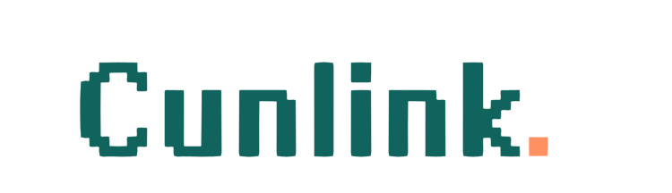

<p align="center">
  
</p>

<h3 align="center">Short Links · Simple Management</h3>

<p align="center">
  <a href="./README.md"><strong>中文</strong></a>
</p>

---

# Cunlink

> A personal URL shortener running on Cloudflare Workers + D1.
> Maintained by [Web3村长](https://cunzhangblog.com), customized from [shrtnr](https://github.com/oddbit/shrtnr).

Lightweight, fast, fully under your control. Shorten long URLs with one click and track clicks in real time.

## Features

- **Free hosting** on Cloudflare Workers + D1 — no servers, no monthly cost
- **Short slugs** starting at 3 characters, plus custom slugs
- **Click analytics** with referrer, country, device, and browser tracking
- **Bundles** group related links and track combined engagement
- **Admin dashboard** for link management, analytics charts, and QR codes
- **Multi-language UI** — English and Chinese

## Quick Deploy

### One-click

[](https://deploy.workers.cloudflare.com/)

### Manual

```bash
git clone https://github.com/cunzhang/cunlink
cd cunlink
yarn install
npx wrangler login
npx wrangler d1 create cunlink-db
npx wrangler deploy
npx wrangler d1 migrations apply DB --remote
```

### Local Development

```bash
yarn install
npx wrangler d1 migrations apply DB --local
npx wrangler dev
```

Then open `http://localhost:8787` in your browser.

### Dev mode (skip login)

Create `.dev.vars` in the project root:

```
DEV_IDENTITY=dev@local
```

Run `npx wrangler dev` and you'll be automatically signed in.

## Access Control

The admin UI (`/_/admin/*`) ships without built-in authentication. We recommend using [Cloudflare Access](https://developers.cloudflare.com/cloudflare-one/applications/) to protect it.

## Acknowledgments

Cunlink is a derivative work based on [shrtnr](https://github.com/oddbit/shrtnr).

- **Original author**: [Oddbit](https://oddbit.id)
- **Original repo**: [github.com/oddbit/shrtnr](https://github.com/oddbit/shrtnr)
- **License**: Apache License 2.0

Special thanks to the Oddbit team for creating and open-sourcing this excellent URL shortener.

## License

Copyright (c) 2026 [Web3村长](https://cunzhangblog.com)

This project is a derivative work of [shrtnr](https://github.com/oddbit/shrtnr) and is licensed under the **Apache License, Version 2.0**.

```
Licensed under the Apache License, Version 2.0 (the "License");
you may not use this file except in compliance with the License.
You may obtain a copy of the License at

    http://www.apache.org/licenses/LICENSE-2.0

Unless required by applicable law or agreed to in writing, software
distributed under the License is distributed on an "AS IS" BASIS,
WITHOUT WARRANTIES OR CONDITIONS OF ANY KIND, either express or implied.
See the License for the specific language governing permissions and
limitations under the License.
```

See the [LICENSE](./LICENSE) and [NOTICE](./NOTICE) files for full details.
